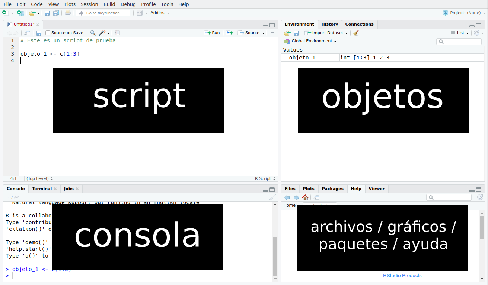

```{r setup, include=FALSE}
knitr::opts_chunk$set(warning = FALSE, message = FALSE) 


```

## Hola R!!

{}


## Crear proyectos en RStudio


Para crear un nuevo  proyecto  podés entrar en: 


* *File ->New project* 

Luego poner el nombre de la carpeta.

{width="337"}

## Crear archivo en R


Para crear un nuevo  archivo *(en este ejemplo  Rmarkdown)* dentro del proyecto actual, podés entrar en: 


*File->New File->RMarkdown*

Luego poner el nombre al archivo. 
 

{width="400"}

## Paquetes

-   1° Instalamos los siguientes paquetes: 


`tidyverse `

`googlesheets4`

`DataExplorer`

`funModeling`

`kableExtra`


- 2° Los llamamos para usarlos en este proyecto. ¿ Cómo los invocamos?: 

```{r echo=FALSE}

library(tidyverse) 
library(googlesheets4)
library(DataExplorer)
library(kableExtra)
library(funModeling)
```


```{r}

#Te invitamos a buscar luego, para qué sirve  cada uno 

# Cargar el paquete tidyverse:


# Cargar el paquete googlesheets4:


# Cargar el paquete DataExplorer:


# Cargar el paquete funModeling:


# Cargar el paquete kableExtra:


```

>Recuerden:

>>La instalación de los paquetes se hace una sola vez por computadora.

>>La carga de los paquetese se hace cada vez que se abre un script.


## Objetos

Creamos objetos que vamos a utlizar en diversas oportunidades. ¿Te animas a crearlos?

```{r echo=FALSE}

blue<- "344D7E" 
fuente<-"Fuente: Elaboración propia"  

```


```{r}

# Creamos un  primer objeto  que se llame "blue" que contiene el siguiente valor  "344D7E"


# Creamos un  segundo  objeto  que se llame "fuente" que contiene el siguiente valor  "Fuente: Elaboración propia"


```

Consultemos los objetos creados: 

```{r}
# Consultá el objeto "blue" 


# Consultá el objeto "fuente" 


```

------------------------------------------------------------------------


## Los datos


Incorporamos la base  de datos a utilizar. La misma las tenemos en el  Drive. 


*¿ Como incorporamos un archivo del drive?*

Usamos la funcion `read_sheet()`, a  la cual tenemos que decirle dónde encontrar el archivo: 


- Se copia una parte de la URL:

```{r echo=FALSE}

original<- read_sheet("15Whz2abOoMbM1FhWTmGk35bugP7M9FHcL8wauu0B46A") # 1° hoja # Despues borrarlo para la act!


```


```{r}

# copiamos una parte de la URL y lo pegamos dentro  de las comillas. 

#*https://docs.google.com/spreadsheets/d/15Whz2abOoMbM1FhWTmGk35bugP7M9FHcL8wauu0B46A/edit?usp=sharing*  
  

#original<- read_sheet("") # 1° hoja # Despues borrarlo para la act!
  

```


Hacemos una copia de la base original y la llamamos "n1":

```{r echo=FALSE}

n1<-  original 


```


```{r}
# asignamos "original" a n1

#n1<- 
  

```

## Exploración de Datos


**Estructura**

Una función que nos permite ver la *estructura* del dataset es `str()`:


```{r}
# Completá en la función  la base de dato a consultar. 

#str()


```


**Visualizar**

¿Cómo podemos visualizar nuestro dataset? Con la función `view()`:


```{r}
# Completá en la función  la base de dato a consultar. 

#view()


#Qué tamaño tiene?

```

**Tamaños**

¿Cuántas filas y columnas tiene "n1"? 


Consultamos el tamaño de nuestro dataset, con la función `dim`:

```{r}

# Completá en la función  la base de dato a consultar

#dim ()
```

**Formatos**

Consultamos los formatos de  las variables con la funcion  `glimpse()` . ¿ Para qué lo necesitamos?

```{r}
# Completá en la función  la base de dato a consultar

#glimpse()
```


**Cambiar nombres de columnas**

Empezamos  trabajando con los nombres de las columnas. Para eso usamos la funcion `names()`: 

```{r}
# Completa en la función names la base de dato a consultar

#names()
```

De ser necesario, cambiamos los nombres de las columnas, con la funcion `rename ()`.


```{r}

# Mirá el formato de la función "rename"

n1<- n1 %>% 
  rename("Hs.Extras.100%" = "100%")%>% 
  rename("Hs.Feriado" = "100% FT")%>% 
  rename("Hs.Noct" = "Noc")%>% 
  rename("Hs.Noct.50%" = "Noc 50%")%>% 
  rename("Hs.Noct.100%" = "Noc 100%")%>%
  rename("Hs.Viaje" = "Horas Viaje")%>%
  rename("2°Vianda" = "D.Vianda")%>%
  rename("Centro.Costo" = "CC")


# Cambiale el nombre e la columna "50%" por "Hs.Extras.50%" :

#n1<- n1 %>% 
# rename(""="")

```


**Manipular dataset**


Quiero visualizar solo 3 columnas  de n1:  `Legajo` , `Activo` y `Convenio`. Lo hacemos con la función `select()`:

```{r}

# Completá las columnas que queremos seleccionar: 

# ¿ Te acordas qué hacia el pipe ( %>% )? 


#n1%>% 
#  select()


```


Quiero eliminar 1 columna   de n1 `Vacaciones` que no voy a utilizar. Lo hacemos con la funcion `select()`.

¿ Te animas a escribirla?

```{r}

#Al finalizar la función corroborá que se haya eliminado

#n1<-n1 %>% 
#  select()


```


Quiero consultar todas las personas mayores de 45. Lo hacemos con la función `filter()`:


```{r}

#n1 %>% 
#  filter(Edad>45)

```

La siguiente función tiene un error, ¿ Te animas a cooregirla y correr el código?

```{r}

# Filtrar por las personas con 18 años de Edad

#n1 %>% 
#  filter(Edad=18)

```


Vamos a achicar nuestro datset. 

Solo nos vamos a quedar con las siguientes columnas de n1. ¿ Cómo lo hacemos?

`Legajo`, `Centro.Costo`,  `Edad`,  `Activo`, `Convenio`, `Hs.Extras.50%`, `Hs.Extras.100%`, `Hs.Noct`, `Enfermedad`, `Vacaciones`


```{r}


# Crear un nuevo data frame con las columnas seleccionadas
# ayuda: a la siguiente formula solo falta agregarle 1 verbo de tidyverse: 


#n1 <- n1 %>%  #  por qué esta 2 veces n1?
                    


```

Cómo quedo nuestro nuevo datset? 


¿ Con qué función podemos visualizarlo?

```{r}

# Escribi la funciòn para visualizar


```


¿ Cuàl es el nuevo  tamaño?

```{r}

# Escribi la funciòn para consultar el tamaño


```


------------------------------------------------------------------------


**Resumenes**

La siguiente formula está completa, la vamos a usar para contar los activos y no activos.

Tenemos que asignarlo a un objeto nuevo que se llame "nomina": 


```{r eval=FALSE}

# Asigna toda la formula a un objeto de tipo tabla,  llamado "nomina"


n1 %>% 
  select(Activo) %>%
  mutate(cuenta = 1) %>% 
  group_by(Activo) %>% 
  summarise(Cuenta = sum(cuenta)) %>% 
  arrange(-Cuenta)


```

Visualicemos cómo quedo la tabla creada:

```{r}

# Escribir la funciòn para visualizar la tabla


```

Podemos mejorar la visualizacion de la misma tabla , con la funcion  `kable()`:


```{r}

#nomina %>% 
#  kable()
```


Queremos saber la edad promedio por centro de costo a fin de  evaluar  acciones concretas de beneficios: 


```{r}

n1 %>%
  select(Centro.Costo, Edad) %>% # Selecciona las columnas
  group_by(Centro.Costo) %>%  # Agrupa por la variable centro de Costo
  summarise(edad_promedio = mean(Edad)) %>% # Crea una variable con la edad promedio
  arrange(-edad_promedio) # Ordena descendentemente los resultados

```

Te animas a calcular la edad promedio por centro de costo, pero solo de los activos:  


```{r}

# Escribir la funciòn para saber la edad promedio de los activos 


```

**Gráficos**

Veamos algunas opciones para visualizar los datos. 


Algo que siempre debemos hacer con las variables numéricas es analizar su distribución.

Para eso podemos usar la función `plot_histogram()`.


```{r}

# Escribir la función y la base de datos a consultar:  


```


Si solo quiero consultar la variable `Edad`:


```{r}

plot_histogram(n1$Edad)

```

Otra visualizacion de todas las variables numericas en con la siguiente funciòn `plot_num()`:

```{r}


# Escribir la funciòn y la base de datos a consultar:  


```
Seleccionemos 3  variables  para visualizar con `plot_num`:

```{r}

# Se ven todas las variables? ¿Qué pudo haber pasado?

n1 %>% 
select(Edad,Convenio, Activo) %>% 
plot_num()

```
Llegamos al Final!


------------------------------------------------------------------------

Repo para practicar:

[Github](https://github.com/YanelPaulette/IntroduccionR.git)

------------------------------------------------------------------------


------------------------------------------------------------------------

### Contacto

[R4HR Club de R para RRHH](https://linktr.ee/r4hrclub)

[Yanel Paulette](https://yanelpaulette.netlify.app/)


------------------------------------------------------------------------
